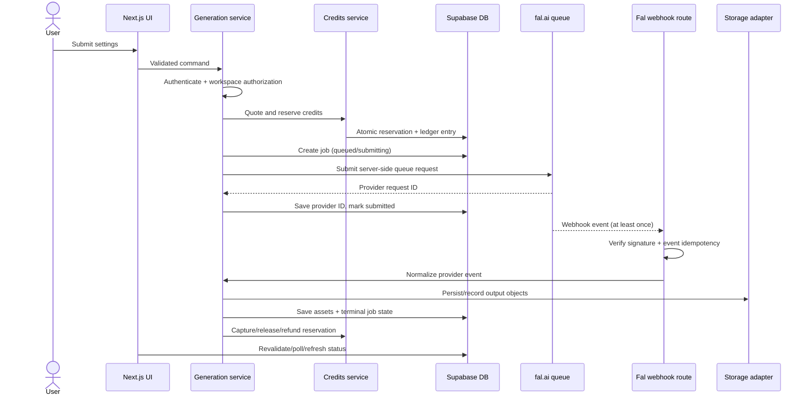

# EOS Creative Studio — Generation Job Lifecycle

## Canonical flow



## State machine

```text
draft
  -> validating
  -> reserving_credits
  -> queued
  -> submitting
  -> submitted
  -> processing
  -> completed

validating/reserving_credits/submitting/queued/submitted/processing
  -> failed

submitted/processing
  -> cancelled (only if provider cancellation is supported and authorized)
```

The database stores the state transition history or structured transition timestamps. Terminal states are `completed`, `failed`, and `cancelled`.

## Transaction and failure rules

1. Validate input with a shared Zod schema on the server. Client validation is only UX.
2. Resolve the authenticated user and verify active membership plus required project access.
3. Calculate price from a server-owned pricing/model catalog. Never trust a client-supplied credit amount.
4. In one database transaction, create a credit reservation and a job with a unique client idempotency key.
5. Submit to fal.ai only after the reservation exists. If submission fails, mark the job failed and release the reservation.
6. Persist the fal.ai request ID before returning success. If the response is lost, a reconciliation path may query fal.ai using the idempotency key or provider request metadata.
7. Webhook processing must acknowledge duplicate events safely. Store a unique provider event key before applying its effect, or use an equivalent transaction-safe inbox.
8. Normalize provider output. Create asset records only after validating output type, size, and allowed storage policy.
9. On success, capture the reserved amount. On provider failure/cancellation, release or refund according to the pricing policy. All ledger operations are idempotent.
10. Revalidate the relevant UI path or provide a bounded polling/refresh mechanism. Realtime subscriptions are optional, not required for correctness.

## Idempotency keys

- `client_request_id`: generated by the client or server for user retry protection; unique per workspace/user command.
- `job_id`: EOS canonical identifier.
- `provider_request_id`: fal.ai identifier; unique where supplied.
- `provider_event_id`: webhook inbox key; unique per provider event.
- `credit_operation_key`: deterministic per job and operation, for example `job:<jobId>:capture`.

## Output handling

fal.ai remains the renderer. The webhook handler records provider output URLs/metadata and either references provider-hosted output under an explicit retention policy or copies the bytes through the storage abstraction into workspace-owned storage. The copy decision is an unresolved product/operations decision and must not be hardcoded into the domain model.

## Reconciliation and recovery

Deferred from the first slice but required before broad production use:

- Periodic reconciliation for jobs stuck in `submitted` or `processing`.
- Operator action to replay a verified webhook event.
- Expired reservation sweeper.
- Alerting for provider/database/storage divergence.

