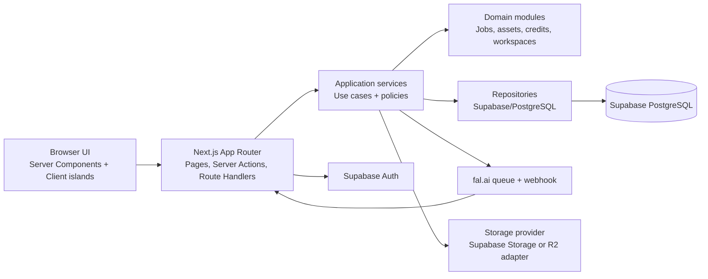

# EOS Creative Studio — System Overview

## Status

Architecture baseline for the initial production implementation. No business features are implemented by this document set.

## Current repository baseline

The repository is a minimal Next.js scaffold:

- Next.js `16.3.0` with App Router and React `19.2.8`.
- TypeScript `5` with `strict: true`, `moduleResolution: bundler`, and `@/*` mapped to `src/*`.
- Tailwind CSS `4` through `@tailwindcss/postcss`.
- ESLint 9 with `eslint-config-next`.
- Source files currently limited to `src/app/layout.tsx`, `src/app/page.tsx`, and `src/app/globals.css`.
- Static assets are in `public/`; supplied product references are in `docs/reference/`.
- No Supabase, fal.ai, Zod, React Hook Form, shadcn/ui, storage adapter, billing ledger, tests, or application modules exist yet.

The initial page remains the create-next-app placeholder and the root metadata still uses the default title and description.

## Target architecture

EOS Creative Studio will be a modular monolith deployed as one Next.js application. The browser talks to the application server; privileged server-side modules talk to Supabase and external providers. fal.ai owns AI image and video generation and rendering. EOS never renders video locally.

## Runtime boundaries

### Presentation

`src/app` owns route composition, loading/error states, metadata, and thin actions/route handlers. `src/components` owns reusable UI. Server Components are the default. Client Components are limited to form state, drag/drop, media controls, optimistic UI, and other browser-only interactions.

### Application

`src/modules/*/application` contains use cases such as `submitGeneration`, `processFalWebhook`, `reserveCredits`, `completeGeneration`, and `listAssets`. Use cases orchestrate repositories and providers; they do not contain JSX or provider-specific transport details.

### Domain

`src/modules/*/domain` contains entities, value objects, state transitions, policies, and errors. Domain code is deterministic and provider-agnostic. Credit reservation/finalization rules live here, not in UI code.

### Infrastructure

`src/infrastructure` contains Supabase clients, repository implementations, fal.ai and storage adapters, webhook signature verification, observability, and configuration parsing. Infrastructure is replaceable behind application ports.

## Non-goals and explicit exclusions

- No Remotion, HyperFrames, FFmpeg workers, local video rendering, composition engines, BullMQ, Redis, or custom rendering workers.
- No microservices in this phase.
- No direct browser-to-fal.ai submission; provider credentials remain server-side.
- No provider-specific response objects exposed as public API contracts.

## Architectural principles

1. Every tenant-owned record is scoped by `workspace_id`.
2. Authorization is checked inside every mutation and privileged read path.
3. Credit changes are append-only ledger entries with idempotency keys; balances are derived or maintained transactionally.
4. External events are treated as at-least-once delivery and processed idempotently.
5. Database access is isolated behind server-only repositories and filtered DTOs.
6. Provider payloads are stored as sanitized snapshots for support and reconciliation, never trusted as authorization input.

