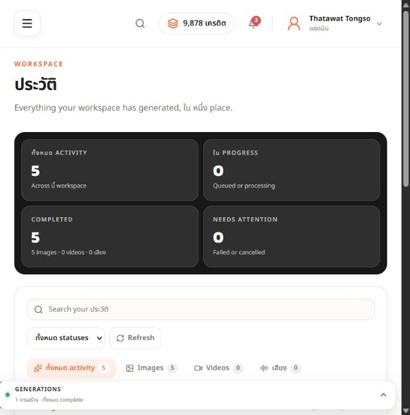
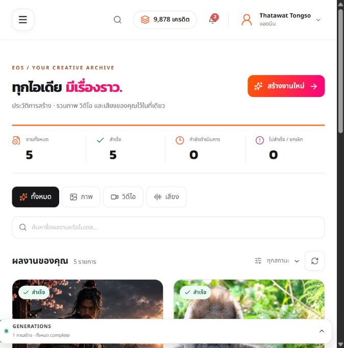
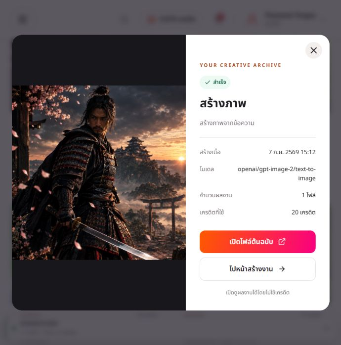
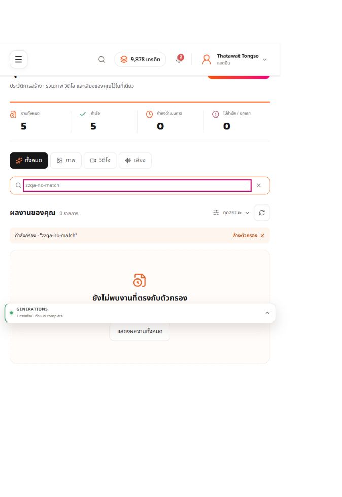
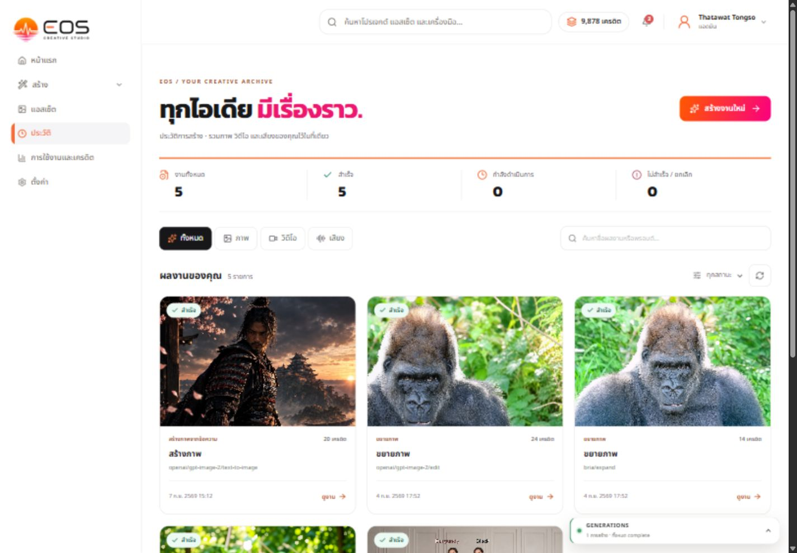
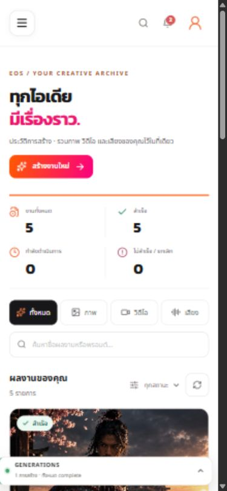

# History UX/UI + QA — 7 September 2026

## Scope

Existing EOS `/history`, authenticated workspace, read-only browsing. No new generations, credit spending, deletion, or backend records changed. Used Product Design Audit to capture the existing screen before implementing scoped improvements with the existing EOS fonts, white background, black filters, orange/pink accent and real generated images.

## Evidence and steps

1. **Initial overview — issues confirmed.** Oversized dark summary obscured outputs in the first viewport. Mixed translated English/Thai text and system-instruction titles were visible. Summary counts and media categories were already present.

2. **Updated overview — passed live inspection.** Compact summary, clearer Thai labels, real image previews aligned to the top, visible detail buttons, search/type/status filters. Same-size comparison shows images enter the first viewport now.

3. **Work detail — passed.** Opened the first image, full image visible without cropping its head, metadata/credit cost displayed. Escape closes and restores focus to the opening button. Native modal supplies focus containment. Original-file link is present; no download or generation was submitted.

4. **Filtering/search — passed.** Video filter returned zero results. Searched `zzqa-no-match`; empty-state guidance and clear controls appeared. Cleared filters and five live results returned. Failed-status filter also returned zero and reset correctly. Loading is labelled; the empty state is captured below (page scrolled).

5. **Responsive — passed basic layout check.** At 1440px there are three cards per row and at 390px one; no horizontal document overflow at either width. Returned preview to original viewport. Existing floating generation widget can overlay the bottom viewport edge; page bottom padding allows content to scroll above it.

## Functional fixes

- Added server-offset pagination, 24 per page, exact visible range and disabled boundary controls; resets on filter changes and recovers when the final page empties.
- Category controls use labelled pressed buttons instead of incomplete tab semantics.
- Stable card keys preserve media elements during background refresh. Polling skips in-flight requests to avoid repeatedly aborting slow responses; polling and window-focus refresh pick up status changes.
- Open detail reconciles with the current returned item; media resets when its URL changes.
- Preview failure offers retry instead of a broken image. Completed-without-URL is not labelled as still waiting.
- Creator link says “ไปหน้าสร้างงาน”; it does not falsely promise to restore/retry all settings.
- Known system-instruction titles use the existing project title sanitizer. Search copy now matches backend support (title/model, not prompt).
- API supports AbortSignal and validates required response fields.

## Verification / limits

- `npx tsc --noEmit`: passed.
- `node scripts/qa-history-api.cjs`: six checks passed (valid shape/query/auth; all supported source/status variants; malformed fields; invalid JSON/HTTP errors; no token; abort stages).
- ESLint: no errors; one intentional Next image-optimization warning for dynamic generated `` URLs.
- Live browser captured no console errors at the final check.
- Separate QA agent reviewed before/after code; identified refresh-remount, slow-poll abort, stale-dialog and misleading-search-copy issues, fixed before handoff.
- Live workspace has only five image jobs. Multi-page navigation with >24 jobs, video/audio playback, CDN failure retries, and processing-to-completed transitions were code-reviewed, not live end-to-end tested. No full WCAG conformance claim.
