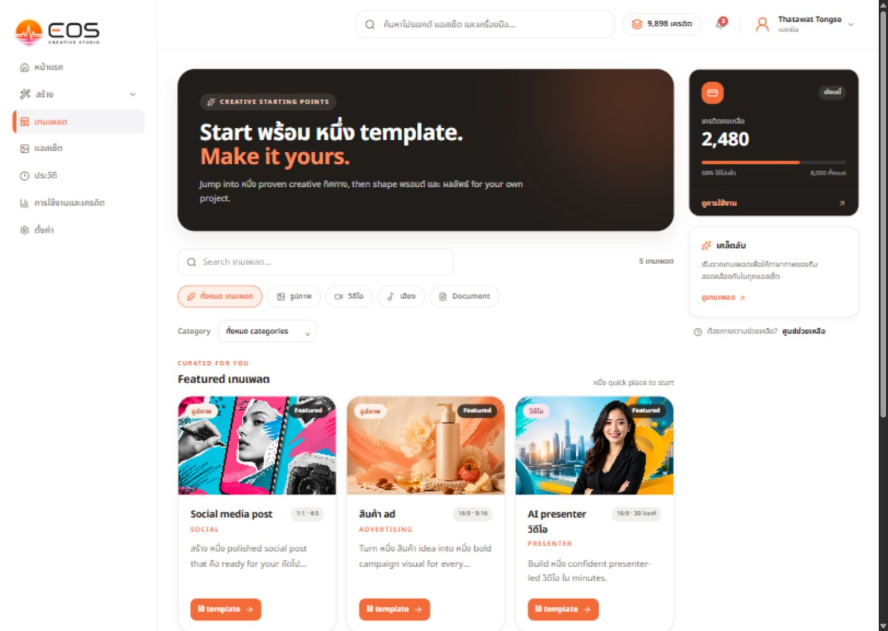
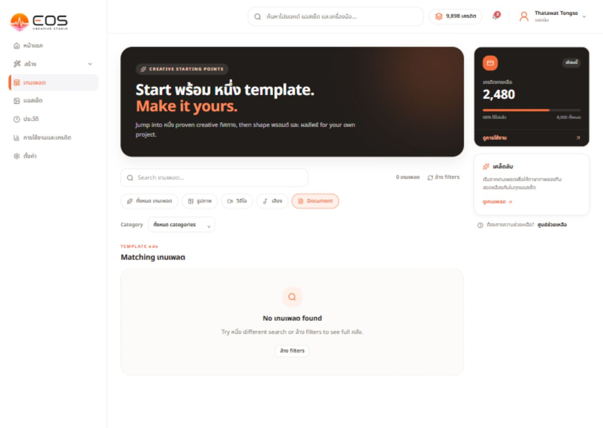
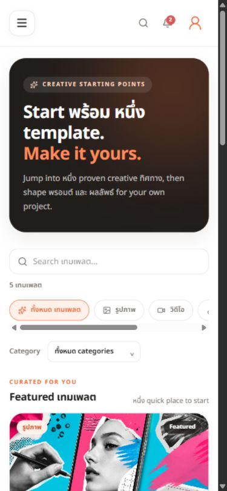

# Templates UX/visual QA — 2026-09-07

Scope: authenticated /templates, desktop 1440x1024 and mobile 390x844. Read-only inspection plus Document filter and clear-filter interaction. No generation/payment performed. This is not full functional or WCAG certification.

1. Desktop landing: needs redesign. Artwork starts around 640px down the screen; oversized text-only hero and a right rail take priority. Mixed Thai/English fragments reduce readability. Header credit balance 9,898 conflicts with rail 2,480. Five templates loaded.

2. Document filter: empty state works (zero records); clear filters restores all five templates. Copy still has translation fragments. Tab keyboard arrow interaction not tested; source buttons lack explicit arrow-key handling.

3. Mobile: primary artwork starts near the bottom of first viewport. Type tabs scroll horizontally; long intro consumes attention before any result is visible. No mobile template-selection completion tested.

Recommendations: lead with actual template output rather than promotional text; use coherent localized copy; remove redundant right rail, retaining the real header balance; compact search/type controls; clear preview/use-template actions. Preserve existing five template types/content, API filtering and targetPath contracts. Generated concepts are design mockups, not evidence of additional real templates or completed functionality. Keep headline as accessible HTML; never implement full-screen mockup as bitmap.

Three conceptual directions: cinematic featured output, editorial artwork gallery, preview-and-remix workspace. Await visual choice before implementation.
