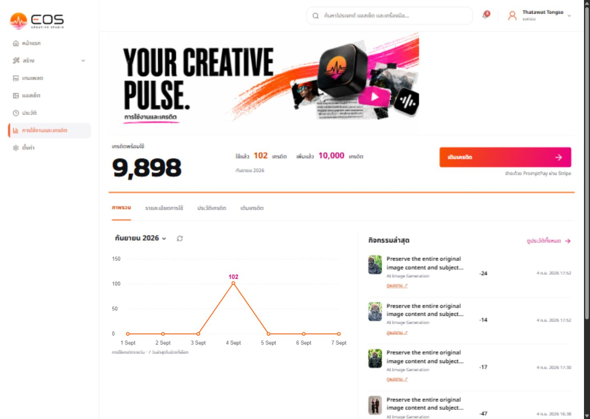
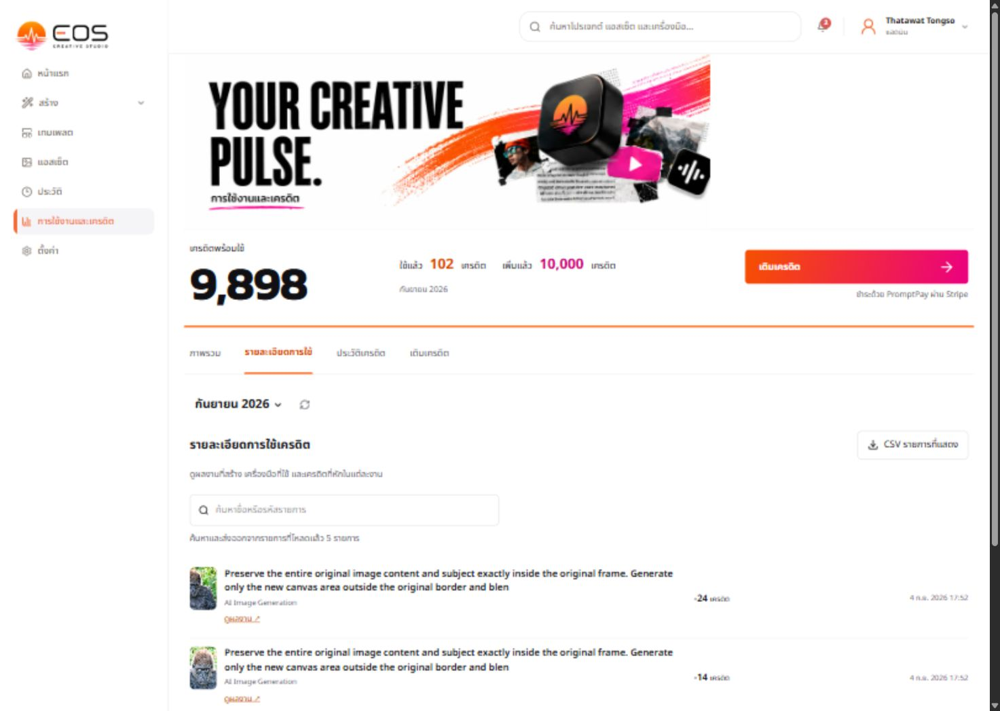
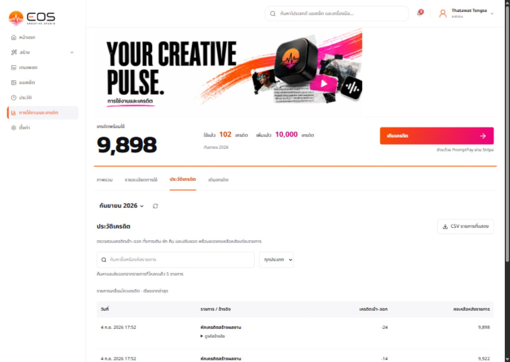
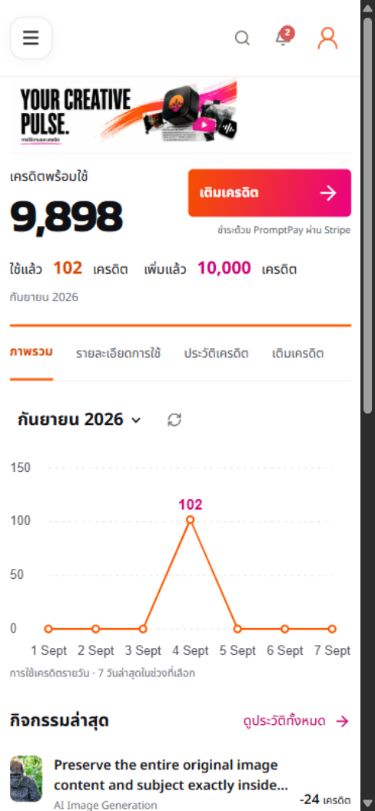

# Usage hero QA — 2026-09-07

Scope: read-only visual/UX audit with current authenticated in-app browser. Desktop viewport 1488×1058, mobile 390×844. Saved screenshots inspected. No app code or financial data changed.

1. Desktop overview — needs visual refinement. Hero composition occupies only the left portion, leaving a large empty right area. Header search, notification and account controls are visible; the requested header credit badge is not visible. Balance and top-up remain prominent.

2. Usage details — navigation and real output thumbnails work. Long repeated prompt text is not a useful distinct work title; model is not displayed. First rows sit low because hero, balance, tabs and filters remain above them.

3. Credit history — distinct financial table loads with signed movements and recorded balances. Expandable reference controls exist. This audit did not exercise filters, downloads or payment completion.

4. Mobile overview — primary balance and top-up remain visible. Hero subtitle is too small to comfortably read. The full-image scaling approach does not provide independent responsive text sizing.

Recommendation: use live HTML for the headline and Thai subtitle; generate only decorative EOS collage/brush artwork with a wide composition suitable for a shallow hero, placed to the right on desktop and reduced or hidden on mobile. Do not generate another all-in-one text-and-art bitmap or stretch the existing one. Preserve the selected orange/pink/black brand direction. Fix layout as well as artwork.

Limits: visual inspection and tab switching only; not comprehensive accessibility certification, browser compatibility, checkout/webhook testing or image-link destination validation. Screenshot capture appears softened across the entire UI, so no claim is made about the source image's resolution from these captures alone.
